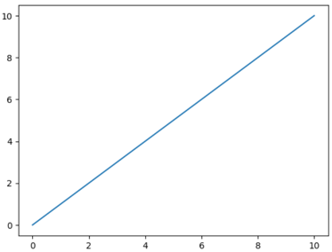
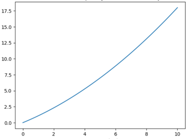

Линейная функция будет в том случае, если базовую структуру компонентов не будут изменять, а только расширять.
Добавлять новые поля, схемы, генераторы, да даже если их объектов получить не json подобную модель, а XML, то
необходимо просто будет написать необходимый генератор и зарегистрировать его в строителе.

Сложность будет увеличиваться, если возникнет необходимость поменять базовый шаблон компонентов, поменять
фреймворк, потому что в проекте используются "батарейки" веб фреймворка.

